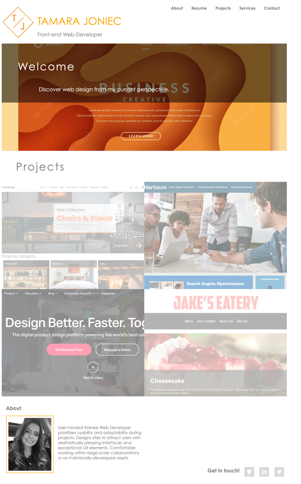

# Bootstrap-Portfolio

## Description

So far I've learned a ton of material: HTML, CSS, GitHub, GitHub Pages, and Bootstrap. My motivation for this project is to recreate my prior portfolio using Bootstrap. 

## Table of Contents

If your README is long, add a table of contents to make it easy for users to find what they need.

- [Installation](#installation)
- [Usage](#usage)
- [Credits](#credits)
- [License](#license)

## Installation

Website URL:
http://tamarajoniec.github.io.tamarajoniec-portfolio/

## Usage

    

## Resources

Bootstrap Documentation: https://getbootstrap.com/docs/4.0/getting-started/introduction/ 

## License

MIT Licence